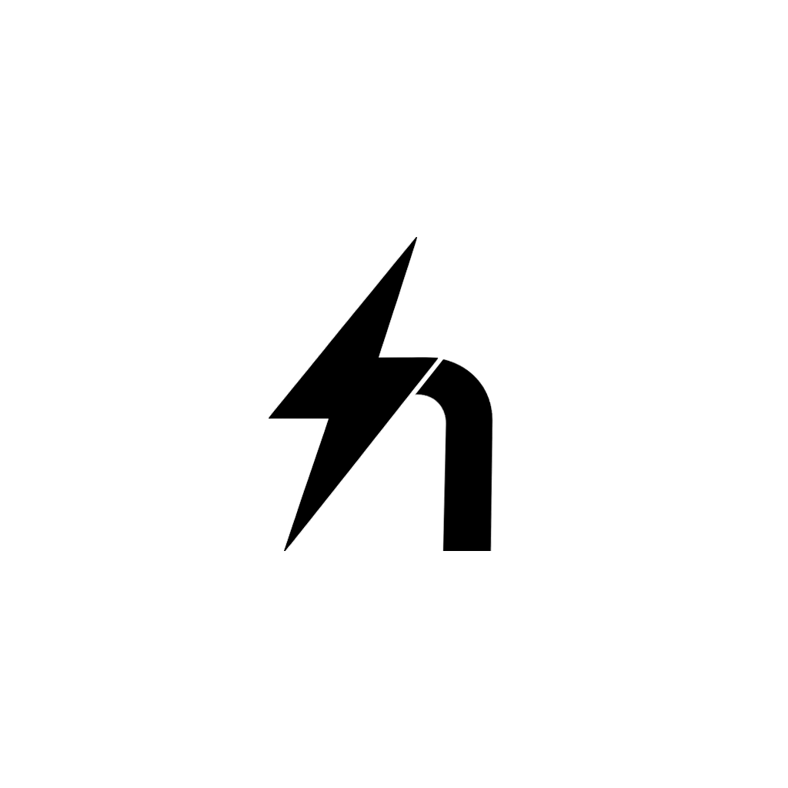
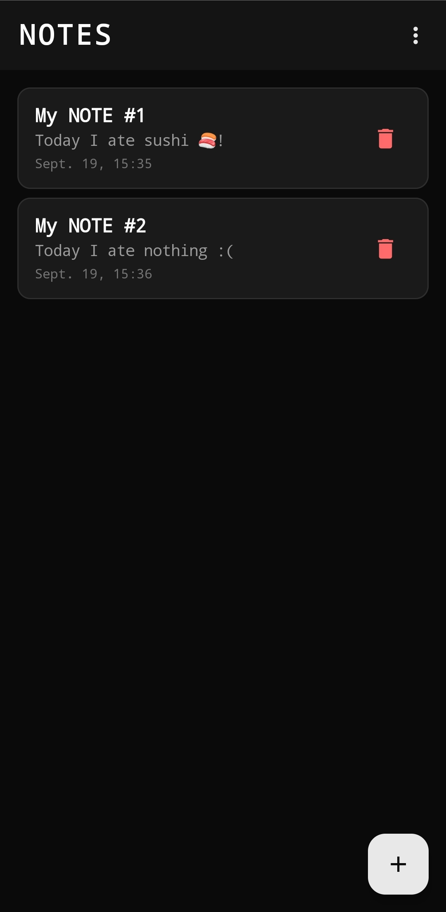
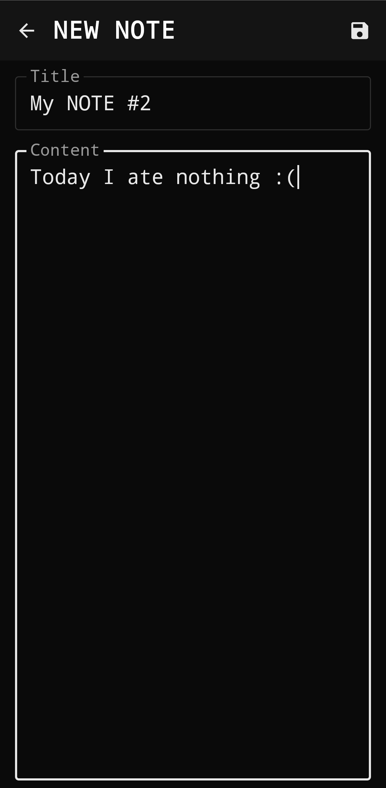
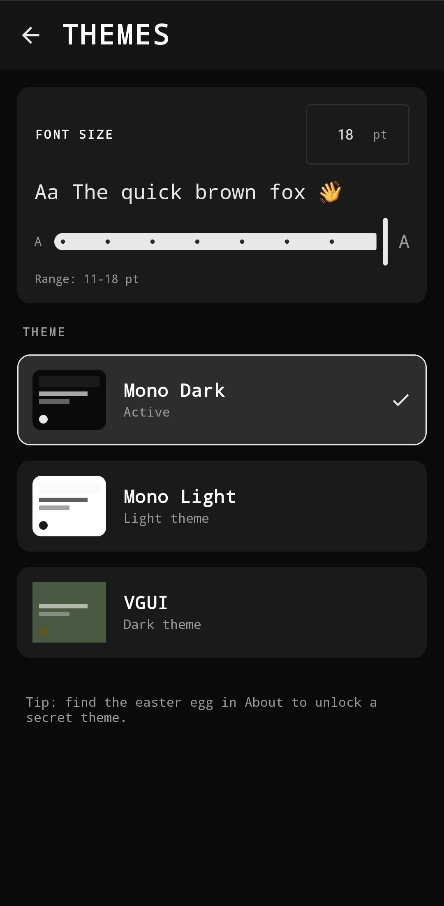
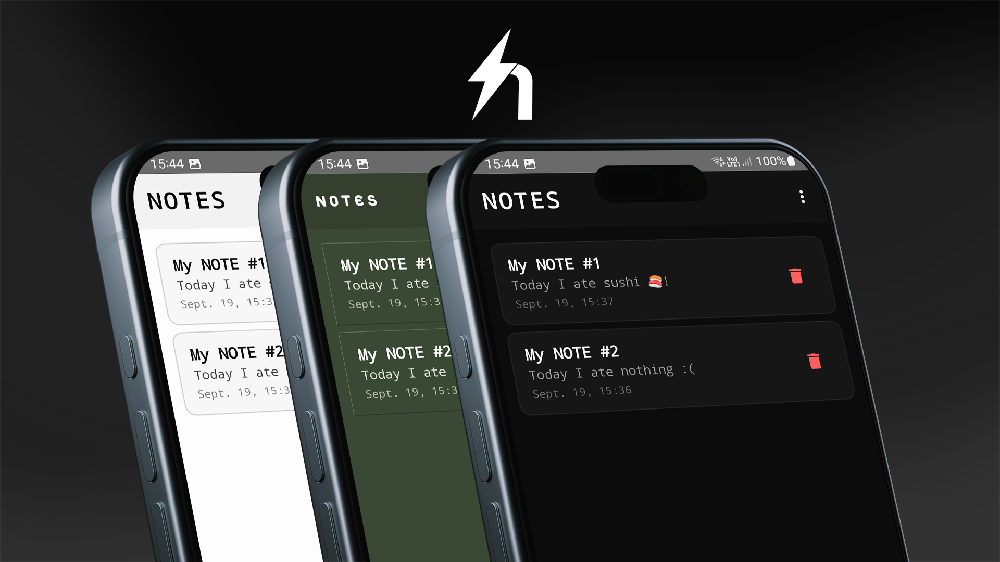
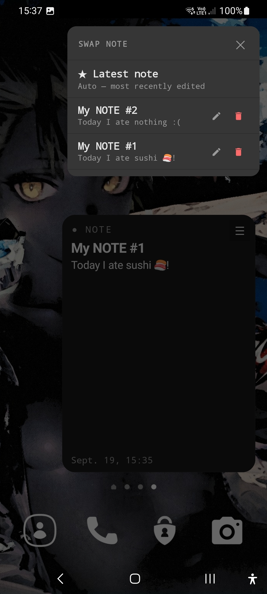

<div align="center">



# NoteShoot

**A minimal, themeable notes app with a home-screen widget.**  
No account. No cloud. No clutter. Just notes.

[](https://opensource.org/licenses/MIT)
[](https://developer.android.com)
[](https://kotlinlang.org)
[](https://developer.android.com/jetpack/compose)

</div>

---

## Screenshots

<div align="center">

| Notes | Editor | Themes |
|:---:|:---:|:---:|
|  |  |  |

</div>

<div align="center">



</div>

<div align="center">

| Widget |
|:---:|
|  |

</div>

---

## What it does

**NoteShoot** is a lightweight notes app with an integrated home-screen widget. Write, edit, and delete notes; pin any note to your launcher; swap between them from the widget itself — no need to open the app.

* **Notes:** Create, edit, delete, and timestamp. Every change is saved to disk immediately.
* **Home-Screen Widget:** Pin any note to your launcher. Tap the widget body to jump straight into the editor with the keyboard up. Tap ☰ for an inline note picker with edit and delete shortcuts.
* **Full Emoji Support:** Emoji render correctly in the app and in the widget, even on launchers that normally strip emoji fonts from widgets (the widget is bitmap-rendered in-app for reliability).
* **Themes:** Three built-in themes — Mono Dark, Mono Light, and a secret VGUI theme hidden behind an easter egg.
* **Font Size Control:** Global text scale from 11 pt to 18 pt, adjustable by slider or manual input.
* **Persistent:** Notes, theme, and font size survive app restarts. No cloud sync, no account, no data ever leaves your device.

---

## How it works

NoteShoot stores everything locally. There is no network code, no analytics, and no third-party SDKs.

* **Persistence:** Notes are serialized to JSON and stored in the app's private `SharedPreferences`.
* **Widget Rendering:** The home-screen widget renders each note into a `Bitmap` in the app's own process (where Android's full font stack, including emoji, is available) and pushes that bitmap into the widget's `ImageView` via `RemoteViews`. This bypasses the launcher's font restrictions and guarantees emoji render correctly on every device.
* **Theming:** A `ThemeSpec` data class holds every color used by the UI. The active theme is stored in `ThemeManager` and read by every composable through a `MaterialTheme` wrapper and `ThemeSpec` extension functions.
* **Widget Sync:** Any change to a note, the active theme, or the font size broadcasts `APPWIDGET_UPDATE` to the widget, which re-renders immediately.

---

## Features

| | |
|---|---|
| **Notes List** | Title, snippet, timestamp — sorted by most recent |
| **Editor** | Auto-focus, keyboard-up, IME-next flow between fields |
| **Widget** | Pin any note, swap from ☰ menu, tap to edit |
| **Widget Picker** | Floating top-right menu with edit and delete shortcuts |
| **Themes** | Mono Dark, Mono Light, and a secret VGUI theme |
| **Theme Picker** | Visual swatches, active indicator, locked-theme hint |
| **Font Size** | 11–18 pt, slider + manual pt input, live preview |
| **About Screen** | License, credits, version, and a hidden easter egg |
| **Easter Egg** | Tap "version 1.0" ten times to unlock VGUI |

---

## Install

| Source | Status |
|---|---|
| **GitHub Releases** | [Download the latest APK](https://github.com/bamBi4k/NoteShoot/releases) |
| **F-Droid** | Coming soon |
| **Google Play** | Coming soon |

Requires **Android 8.0 (API 26)** or newer.

---

## Build from source

```bash
git clone https://github.com/bamBi4k/NoteShoot.git
cd NoteShoot
./gradlew assembleDebug